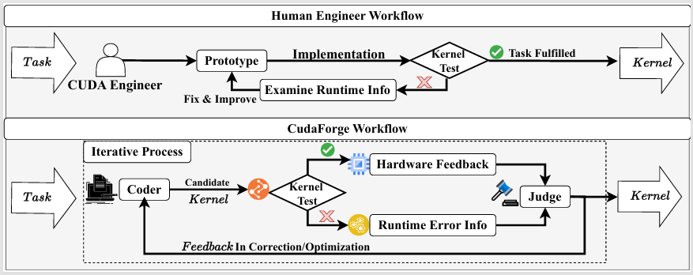

# CudaForge: An Agent Framework with Hardware Feedback for CUDA Kernel Optimization

A training-free multi-agent workflow for CUDA kernel generation and optimization, which is inspired by the iterative workflow of human experts, which contains steps such as developing initial kernels, testing correctness, analyzing hardware feedback, and iterative improvement.



## 🔧 Build Environment
```
conda env create -f environment.yml
```

Note: Some packages may fail to install automatically when creating the environment.
If that happens, please install the missing packages manually using conda install or pip install.
```
pip install torch
pip install openai
pip install pandas
pip install matplotlib
```
## ⚙️ CUDA Toolkit and Build Tools
Please make sure that CUDA Toolkit and Ninja are correctly installed on your system.
Both nvcc (the CUDA compiler) and Nsight Compute (NCU) should be accessible and have matching versions with your installed CUDA Toolkit.

You can verify their availability and version consistency using:
```
nvcc --version
ncu --version
```
If either command is not found or versions are mismatched, please reinstall or update your CUDA Toolkit and Nsight Compute accordingly.
## 🔒 Permission Setup for Nsight Compute
Nsight Compute (ncu) requires elevated privileges to access GPU performance counters.
Please ensure that you have sudo or root privileges on the system.

If you need to enable password-less sudo for profiling commands, you can configure it as follows:
```
sudo visudo
```
Then add the following line (replace <username> with your actual user name):
```
<username> ALL=(ALL) NOPASSWD: ALL
```
After this setup, you can run profiling commands such as sudo ncu without being prompted for a password.
