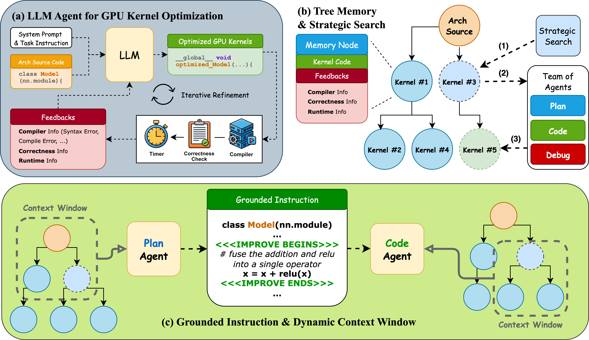
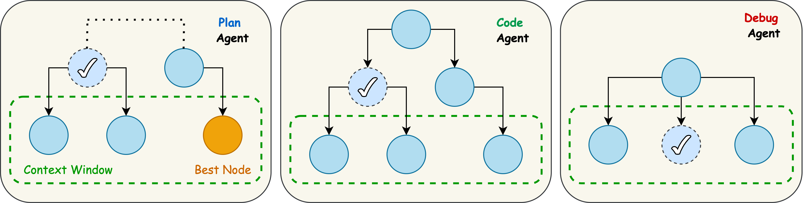

# STARK: Strategic Team of Agents for Refining Kernels

## 0. Metadata
- **Full Title**: STARK: Strategic Team of Agents for Refining Kernels
- **Authors**: Juncheng Dong, Yang Yang, Tao Liu, Yang Wang, Feng Qi, Vahid Tarokh, Kaushik Rangadurai, Shuang Yang
- **Venue / Year**: arXiv 2025 (2510.16996v1)
- **Links**: [PDF](../2510.16996v1.pdf) | [ArXiv](https://arxiv.org/abs/2510.16996)
- **Keywords**: GPU Kernel Optimization, LLM Agents, Multi-Agent System, CUDA, KernelBench
- **Paper ID**: STARK

## 1. TL;DR (3–5 bullets)
- **Problem**: 优化 GPU kernel 是一项劳动密集型且复杂的任务，因为涉及到硬件特定的交互。现有的 LLM 方法（单次生成或简单的反思）无法有效地在这个不规则的设计空间中导航。
- **Idea**: **STARK** (Strategic Team of Agents for Refining Kernels)，一个模仿专家工程师团队的多智能体框架。它将规划、编码和调试分开，并使用**策略搜索**（Strategic Search）在尝试树上进行搜索，而不是线性的优化。
- **System**: 具有**落地指令**（Grounded Instruction，将编辑锚定到特定的代码跨度）和**动态上下文窗口**（Dynamic Context Windows，提供特定角色的历史记录和全局领先者），以协调智能体并提高代码生成的保真度。
- **Result**: 在 KernelBench 上实现了比基线智能体（Reflexion, Sampling）高达 **16倍的加速**。在 Level 1 & 2 任务上保持 **100% 的成功率**，并在 Level 3 上显著优于基线。

## 2. Problem & Motivation

### 2.1 现有方法的局限性
- **人工优化**: 有效但不可扩展且劳动密集。
- **自动调优器/编译器**: 受限于固定的搜索空间或启发式方法；难以处理不规则的算子。
  > "Existing approaches largely fall into two categories: manual optimization... and automated compilers... which apply heuristics or search but often struggle with irregular operators..." (Introduction; Page 2)
- **先前的 LLM 智能体**: 将 LLM 视为单次生成器或使用朴素的线性优化（例如 Reflexion），这容易陷入局部最优，并且无法弥合高层计划与底层代码之间的差距。
  > "Current agents typically refine code linearly... neglecting the rich history of prior attempts... [and] frequently devise a correct high-level optimization plan... but fail to translate it into valid low-level CUDA code." (Introduction; Page 2)

### 2.2 STARK 如何解决这些问题
- **多智能体协作**: 将任务分解为规划（Plan）、编码（Code）和调试（Debug）角色，以处理不同的方面（探索 vs 精确）。
- **策略搜索**: 用基于树的搜索（改进的 $\epsilon$-greedy）代替线性优化，以平衡探索和利用。
  > "We introduce STARK... a novel framework... [with] specialized agents for planning, coding, and reflection... [and] a search policy that balances exploration and exploitation..." (Introduction; Page 2)

## 3. Key Ideas & Contributions
- **多智能体工作流**: 具有不同温度设置的专用智能体（规划智能体温度高，编码智能体温度低）。
- **带树形记忆的策略搜索**: 维护所有尝试的树，允许智能体回溯并探索有希望的分支，而不仅仅是基于最新的尝试。
- **落地指令 (Grounded Instruction)**: 规划智能体在代码中插入特定的锚点（`<<<IMPROVE BEGIN>>>`）来指导编码智能体，减少幻觉并确保计划在预期的位置被准确执行。
- **动态上下文窗口**: 在每一步为每个智能体构建自定义上下文，包括相关的局部历史（兄弟/子节点）和全局高性能 kernel（“领导者”），以促进知识迁移并避免重复错误。

## 4. Method Overview

STARK 模仿了一个工程师团队。它维护一个 kernel 候选者的**搜索树**。在每一步，它使用 $\epsilon$-greedy 策略选择一个节点。然后，它为智能体构建**动态上下文**。**规划智能体**提出带有**落地指令**的优化建议。**编码智能体**实现它。如果失败，**调试智能体**进行修复。新的 kernel 被评估并添加到树中。


> "STARK organizes kernel refinement into three layers: (i) a multi-agent workflow... (ii) coordination mechanisms... and (iii) a strategic search policy..." (Section 4; Page 4)

### 4.1 多智能体协作 (Multi-Agent Collaboration)
- **Goal**: 针对优化的不同阶段专门化 LLM 的行为。
- **Mechanism**:
    - **Plan Agent** ($\tau=0.8$): 创造性探索。提出策略（Tiling, Vectorization）并标记代码区域。
    - **Code Agent** ($\tau=0.1$): 精确实现。将指令转化为 CUDA 代码。
    - **Debug Agent** ($\tau=0.1$): 使用错误日志修复编译/运行时错误。

### 4.2 策略搜索 (Strategic Search)
- **Goal**: 避免线性优化中固有的局部最优。
- **Mechanism**: 维护 kernel 树。使用改进的 $\epsilon$-greedy 策略：
    - **Root Throttling**: 限制根节点的直接子节点数量，避免在开始时陷入困境。
    - **Dead-branch Pruning**: 停止探索失败的分支。
    - **Leaf-biased Exploration**: 鼓励探索新的叶节点。

## 5. Interface / Contract
- **Inputs**: PyTorch 模型源代码（架构定义）。
- **Outputs**: 优化的 CUDA kernel 代码（封装在 PyTorch 扩展中），功能等效但速度更快。
- **Constraints**: 必须能编译并通过针对参考 PyTorch 实现的正确性检查。

## 6. Architecture / Components

### Plan Agent
- **Description**: 分析当前 kernel 并提出优化策略。它插入锚点以指导编码者。
  > "The plan agent proposes targeted transformations... emitting grounded instructions that anchor edits to explicit code spans." (Section 4.1; Page 5)
- **Pseudocode**:
  ```python
  # Input: Context (history, leaders), Current Kernel
  # Output: Plan + Kernel with <<<IMPROVE>>> anchors
  plan, anchored_code = PlanAgent(context, current_kernel)
  ```

### Code Agent
- **Description**: 接收锚定代码和计划，并生成实际的 CUDA 实现。
  > "The code agent consumes this annotated scaffold and resolves each anchor by emitting concrete CUDA that realizes the instruction." (Section 4.3; Page 6)
- **Pseudocode**:
  ```python
  # Input: Context (siblings), Plan, Anchored Code
  # Output: Executable CUDA Kernel
  kernel = CodeAgent(context, plan, anchored_code)
  ```

### Debug Agent
- **Description**: 如果生成的 kernel 编译或验证失败，则修复错误。
  > "The debug agent repairs promising but failing candidates by consulting the plan agent’s instructions and compiler/runtime diagnostics..." (Section 4.1; Page 5)

### Dynamic Context Window
- **Description**: 为每个智能体定制上下文，以最大化相关信息并最小化噪声。
  > "We therefore maintain a dynamic, agent-specific context window that is rebuilt at each selection step..." (Section 4.4; Page 6)
- **Mechanism**:
    - **Plan Context**: 节点 + 子节点 + 全局领导者 (Top-r)。
    - **Code Context**: 节点 + 子节点 + 兄弟节点的子节点 (Cousins)。
    - **Debug Context**: 节点 + 兄弟节点。


> "Dynamic Context Window. Nodes with checkmarks represent selected nodes... The plan agent conditions on a context window... that aggregates node i’s children and a small set of global leaders..." (Section 4.4; Page 6)

## 7. Algorithm

```python
# Algorithm 1: STARK (Strategic Team of Agents for Refining Kernels)
# Inputs: Budget B (最大尝试次数), Root Node n_root (原始 PyTorch 代码)

# 初始化搜索树和排行榜
Tree = {n_root}
Leaders = {n_root}

for t in range(B):
    # 1. 节点选择 (Selection)
    # 使用改进的 epsilon-greedy 策略从树中选择一个节点进行扩展
    # 策略包括: Root Throttling (根节点限流), Dead-branch Pruning (死枝剪枝)
    node = Select(Tree, Leaders) 
    
    if HasBug(node):
        # --- 调试路径 (Debugging Path) ---
        # 如果节点有编译错误或运行错误，进入调试模式
        
        # 构建调试上下文: 包含当前节点及其兄弟节点 (Siblings)
        context = BuildDebugContext(node, Tree)
        
        # Debug Agent: 修复代码错误
        new_kernel = DebugAgent(context, node.code, node.logs)
    else:
        # --- 优化路径 (Optimization Path) ---
        # 如果节点正常，尝试进一步优化
        
        # Plan Agent: 提出优化建议
        # 上下文: 包含当前节点、其子节点、以及全局 Top-r 领先者 (Global Leaders)
        plan_context = BuildPlanContext(node, Tree, Leaders)
        plan, anchors = PlanAgent(plan_context)
        
        # Code Agent: 实现优化建议
        # 上下文: 包含当前节点、其子节点、以及兄弟节点的子节点 (Cousins)
        # 使用 Grounded Instruction (锚点) 确保代码修改在指定位置
        code_context = BuildCodeContext(node, Tree)
        new_kernel = CodeAgent(code_context, plan, anchors)
    
    # 2. 评估 (Evaluate)
    # 编译并运行，获取正确性 (correct) 和运行时间 (runtime)
    ok, correct, runtime, logs = Evaluate(new_kernel)
    
    # 3. 更新状态 (Update State)
    # 将新 kernel 作为子节点加入树中
    new_node = AddChild(Tree, node, new_kernel, logs, runtime)
    # 更新全局排行榜
    UpdateLeaders(Leaders, new_node)

# 返回排行榜中速度最快且正确的 kernel
return Best(Leaders)
```

## 8. Experiments & Results

### 8.1 实验设置
- **基准 (Baselines)**:
    - **Torch Eager**: PyTorch 原生执行。
    - **Torch Compile**: `torch.compile` (default 和 max-autotune 模式)。
    - **Sampling Agent (采样智能体)**: 单智能体，多次采样取最优 (Best-of-N)。
        - **机制**: 独立生成 $N$ 个方案，无记忆，纯概率碰撞。
        - > "This agent repeatedly samples responses... and chooses the best generated custom kernel..." (Experiments; Page 8)
    - **Reflexion Agent (反思智能体)**: 基于 Reflexion 框架 (Shinn et al., 2023) 的单智能体，进行线性迭代优化。
        - **机制**: 基于上一次的反馈（编译器/运行时）进行修改，有短期记忆但易陷入局部最优。
        - > "...follows the Reflexion paradigm... tries to update its last attempt using its corresponding observations..." (Experiments; Page 8)
- **指标 (Metrics)**:
    - **Fast1 Rate**: 生成的 kernel 至少比 Torch 基线快的比例。
    - **Success Rate**: 生成可编译且功能正确 kernel 的比例。
    - **Speed**: 平均加速比（相对于基线）。

### 8.2 主要结果 (KernelBench)
STARK 在所有难度级别上均优于基线，特别是在高难度任务上优势明显。

- **Level 1 (单算子)**:
    - **STARK**: **100% 成功率**，平均加速 **3.03×**。
    - **对比**: Sampling Agent 仅 0.81× (变慢)，Reflexion Agent 1.24×。
- **Level 2 (融合算子)**:
    - **STARK**: **100% 成功率**，平均加速 **2.69×**。
    - **对比**: Reflexion Agent 虽然有 100% 成功率，但平均速度仅为 0.88× (变慢)。STARK 能同时保证正确性和效率。
- **Level 3 (完整模型 - 最难)**:
    - **STARK**: **100% 成功率**，平均加速 **1.58×**。
    - **对比**: Sampling 和 Reflexion 性能严重下降，速度均低于 Torch Eager (0.87× 和 0.79×)。

### 8.3 深入分析
- **编译率 vs 正确率**:
    - 基线智能体虽然编译率高 (>80%)，但功能正确率低 (Sampling 在 Level 1 仅 43% 正确)。
    - STARK 的正确率显著更高 (Level 2 达到 61.2%)，说明结构化规划减少了无效尝试。
- **消融实验 (Ablation Studies)**:
    - **Search Agent (单智能体 + 搜索)**: 优于纯 Sampling。
    - **MA-Only (多智能体 + Sampling)**: 优于纯 Sampling。
    - **STARK (多智能体 + 搜索)**: 效果最好，证明了多智能体协作与策略搜索的互补性。

## 9. Conclusion
本文提出了 **STARK**，一个用于 GPU kernel 优化的多智能体框架。通过结合**多智能体角色扮演**（规划、编码、调试）、**动态上下文管理**和**策略搜索**，STARK 能够像专家工程师团队一样工作。

**核心结论**:
1.  **超越单智能体**: 相比于单次生成或简单的线性反思，多智能体协作配合搜索策略能更有效地探索复杂的设计空间。
2.  **性能突破**: 在 KernelBench 上实现了显著的加速（最高 16×），并且在复杂任务上保持了极高的成功率。
3.  **未来展望**: 这种 Agentic LLM 框架有望在自动化系统优化中发挥重要作用，未来可扩展到更多算子类型、不同硬件架构以及跨 kernel 的调度优化。
