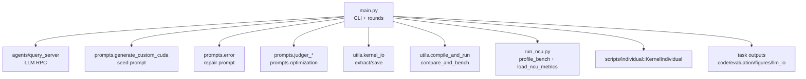
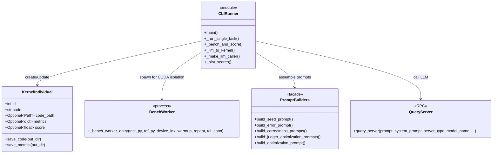
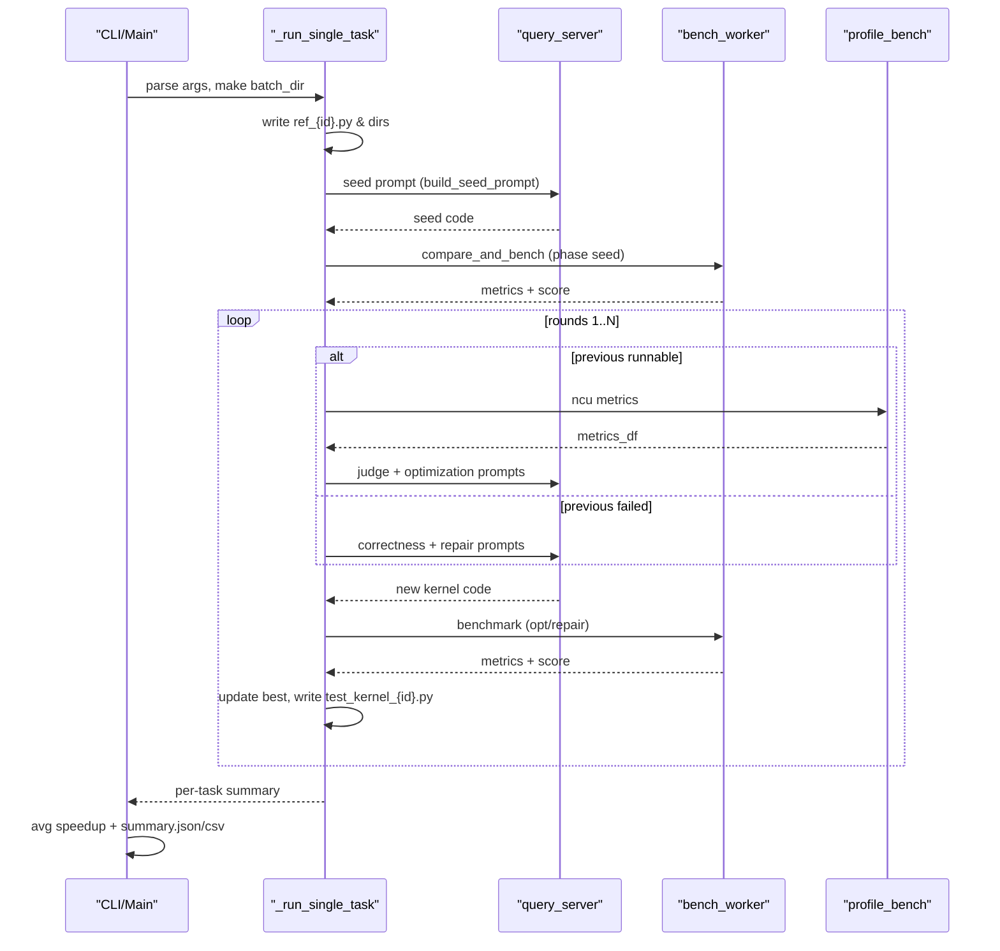

# 架构文档：main.py 自迭代 Kernel Pipeline

## 概览
- `main.py` 负责单/多任务 CUDA kernel 的生成、修复与性能优化，封装 CLI → LLM → 编译基准 → 汇总落盘的全流程。
- 主要阶段：种子生成、错误修复、性能优化；通过分数曲线与 `summary.json/csv` 记录结果。
- 架构模式：命令行 orchestrator + 自迭代流水线 + 子进程隔离 CUDA 基准。

## 关键模块
- **CLI 与任务挑选**：`_build_arg_parser`、`_collect_tasks`、`_pick_first_n`、`_sample_tasks` 支持单文件或目录批量，按时间戳+模型标签创建 `batch_dir`。
- **LLM 调用与提示**：`_make_llm_caller` 封装 `query_server`；`prompts.*` 构造种子/判错/修复/优化提示；`_llm_to_kernel` 落盘回复、提取代码并实例化 `KernelIndividual`。
- **基准与分数**：`_bench_and_score` 以 spawn 子进程运行 `compare_and_bench`，更新 metrics/score，保存 `eval_XXXX.json`，`_plot_scores` 绘制分数曲线。
- **性能剖析**：`profile_bench` + `load_ncu_metrics` → `metrics_to_prompt` 为优化阶段提供 NCU 指标上下文。
- **结果持久化**：代码保存在 `code/`，LLM I/O 在 `evaluation/llm_io/`，指标在 `evaluation/`，曲线在 `figures/`，全局总结在 batch 根目录。

## 运行流程
1. **启动**：解析 CLI，生成 `batch_dir`（时间戳 + `server_type/model`），将参考任务写到 `ref_{subproc_id}.py`。
2. **种子轮 (round 0)**：`build_seed_prompt` → LLM → 落盘代码 → `_bench_and_score` 取得初始分数。
3. **后续轮次**：
   - 上一轮不可运行 → `build_correctness_prompts` → `extract_json` → `build_error_prompt` → LLM 修复 → 基准（phase=repair）。
   - 上一轮可运行 → `profile_bench` → `load_ncu_metrics` → `build_judger_optimization_prompts` 获取策略 → `build_optimization_prompt` → LLM 优化 → 基准（phase=opt）。
4. **状态更新**：记录 `scores/err_flags`，维护 `best_kernel`，并将当前最佳写入 `test_kernel_{subproc_id}.py`。
5. **收尾**：为任务绘制分数曲线，返回 `best_score` 与 `best_runnable` 标记。
6. **多任务**：遍历采样任务，计算平均提速/准确率，写入 `summary.json` 与 `summary.csv`。

## 目录与产物
- `batch_dir/TaskName/`
  - `code/`：所有生成的 kernel。
  - `evaluation/`：`eval_XXXX.json`、`llm_io/`（所有提示与回复、`usage.csv`）。
  - `figures/`：分数曲线。
  - `ref_{id}.py`、`test_kernel_{id}.py`：基准用参考与最新最优 kernel。
- `batch_dir/summary.json` 与 `summary.csv`：全局平均提速、准确率与产物索引。

## 鲁棒性与边界处理
- `_sanitize_error_message`、`_last_n_lines` 剪裁 pybind 大张量日志，避免撑爆 prompt。
- CUDA 隔离：spawn 子进程执行基准；收尾强制 `torch.cuda.synchronize/empty_cache/ipc_collect`。
- 回复降级：`extract_code_block` 失败时回退完整回复；`extract_json` 失败亦可继续构建错误提示。

## 图示
### Package Diagram
（源码同步到 `arch-main-runner/package.mmd`）

### Class Diagram
（源码同步到 `arch-main-runner/class.mmd`）

### Sequence Diagram
（源码同步到 `arch-main-runner/sequence.mmd`）

