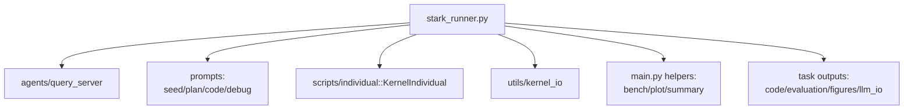
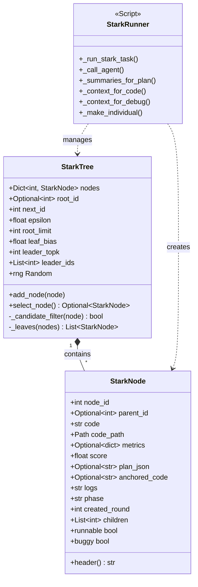
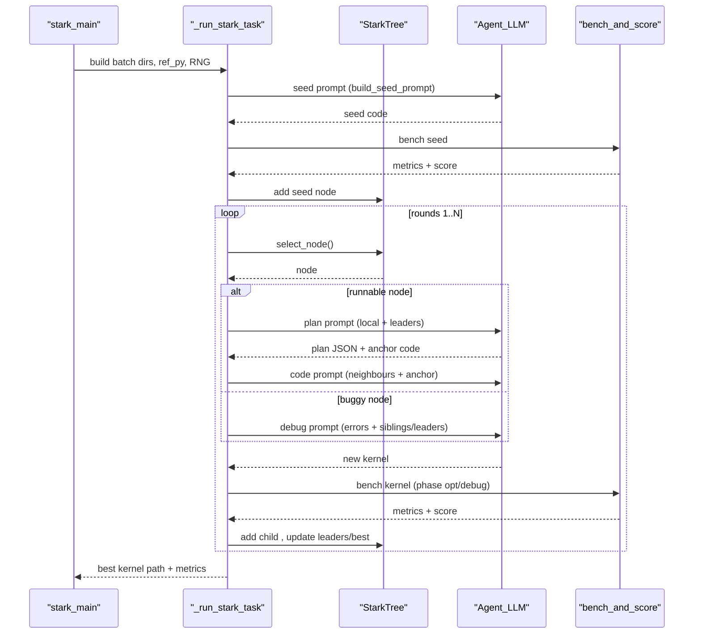

# 架构文档：Stark Runner

## 概览

`stark_runner.py` 运行 STARK（Search-based Task-Adaptive Reasoning with Kernels）流水线。它用带 epsilon-greedy 的树搜索，在 LLM 协助下演化 CUDA kernel，并对每个候选进行基准测试，任务级地持久化全部产物。

- 每个 `StarkNode` 保存代码、metrics、阶段、提示上下文（plan JSON、锚定代码、日志），方便优化/调试分支复用历史思路。
- Runner 将基准测试/绘图委托给 `main.py`，将提示构造交给 `prompts/*`，将代码落盘交给 `KernelIndividual` 与 `utils.kernel_io`。

## 执行流程

- **任务初始化**：创建 `code/`、`evaluation/llm_io/`、`figures/` 等子目录，记录 LLM 流量到 `usage.csv`，并将参考 kernel 写入 `ref_{subproc_id}.py` 以保证基准一致。
- **种子阶段**：向代理请求种子 kernel（`build_seed_prompt`），提取代码，调用 `_bench_and_score`，生成根节点；曲线从种子得分起步（或沿用最近有效分数）。
- **扩展循环**（round `1..args.round-1`）：
  - 用 `StarkTree.select_node` 选取节点（epsilon-greedy，叶子加权，leader 缓存）。
  - runnable → 规划提示（本地+leader 摘要）→ plan JSON → 代码提示（锚定代码 + 邻居/leader 上下文）。
  - buggy → 调试提示（错误日志 + 兄弟/leader + 既有 plan hint）。
  - 基准新 kernel，挂上 metrics/日志尾，更新树、leaders、分数轨迹和 best node。
- **收尾**：绘制分数曲线，落盘 `best_kernel.py`，并写入批次汇总（平均提速、正确率）。

## 树搜索策略

- **状态**：`StarkNode` 记录血缘、代码路径、metrics、得分、提示产物、创建轮次与子节点。
- **候选过滤**：根节点超过 `root_limit` 会限流，其余节点只要仍可扩展均可进入候选。
- **探索**：以概率 `epsilon` 从叶子抽样（按 `leaf_bias` 加权）；若无叶子则退回全池。
- **利用**：优先选通过过滤的 leaders（`leader_topk` 最高可运行分数）；否则取全池最高分。
- **Leader 维护**：可运行节点都会插入 `leader_ids`，保持按分数排序的 top-k，既用于上下文，也用于利用阶段。

## Agent 上下文

- **规划**：`_summaries_for_plan` 展示本地历史（子节点+堂表兄弟）及全局 leaders，避免倒退并复用好思路。
- **编码**：`_context_for_code` 混合兄弟、堂表兄弟的子节点和 leaders，再配合锚定代码与当前 plan JSON，引导增量修改。
- **调试**：`_context_for_debug` 给出兄弟/leader 与最新错误日志尾，复用已有 plan hint。
- 所有提示/回复保存在 `evaluation/llm_io` 便于溯源。

## 产物与依赖

- **任务目录**：`code/`（生成的 kernel）、`evaluation/`（metrics）、`evaluation/llm_io/`（提示 I/O、`usage.csv`）、`figures/`（分数曲线）。
- **外部助手**：`main.py` 提供基准、绘图、运行标记、任务抽样、全局汇总；`KernelIndividual` 与 `save_kernel_code` 负责落盘。
- **批次**：`stark_main` 用 `_build_run_tag` 生成时间戳批次目录，支持单任务或采样任务运行，并写全局总结。

## 架构模式

Runner 是一个结合 **树搜索** 与 **演化优化** 的代理：

- **State**：树节点记录 runnable/buggy 状态与提示上下文。
- **Action**：runnable → 规划+优化；buggy → 调试。
- **Evaluation**：所有动作都经 `_bench_and_score` 更新分数轨迹。
- **Selection**：`StarkTree.select_node` 通过 epsilon-greedy 与 leader 缓存平衡探索和利用。

## 图示

### Package Diagram

下图展示 `stark_runner.py` 对其他模块的依赖。

### Class Diagram

下图展示用于管理搜索树的核心数据结构。

### Sequence Diagram

下图展示单个任务从初始化到扩展循环的执行流程。

